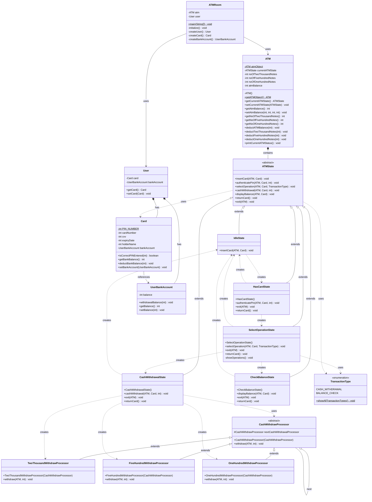
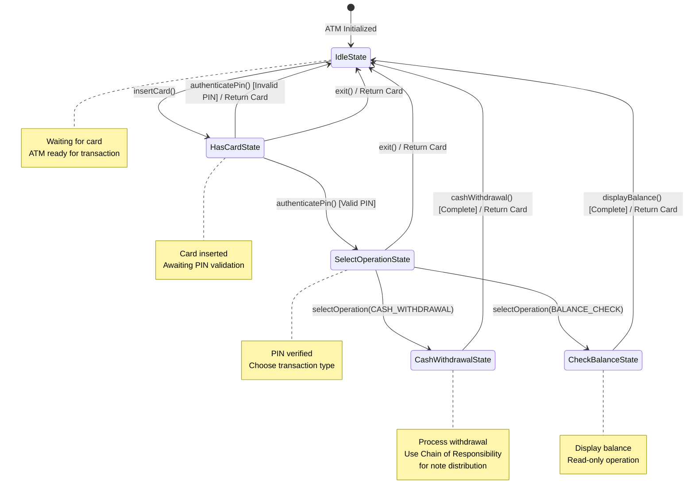
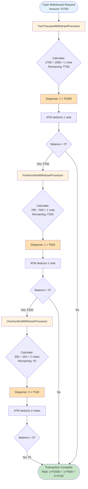
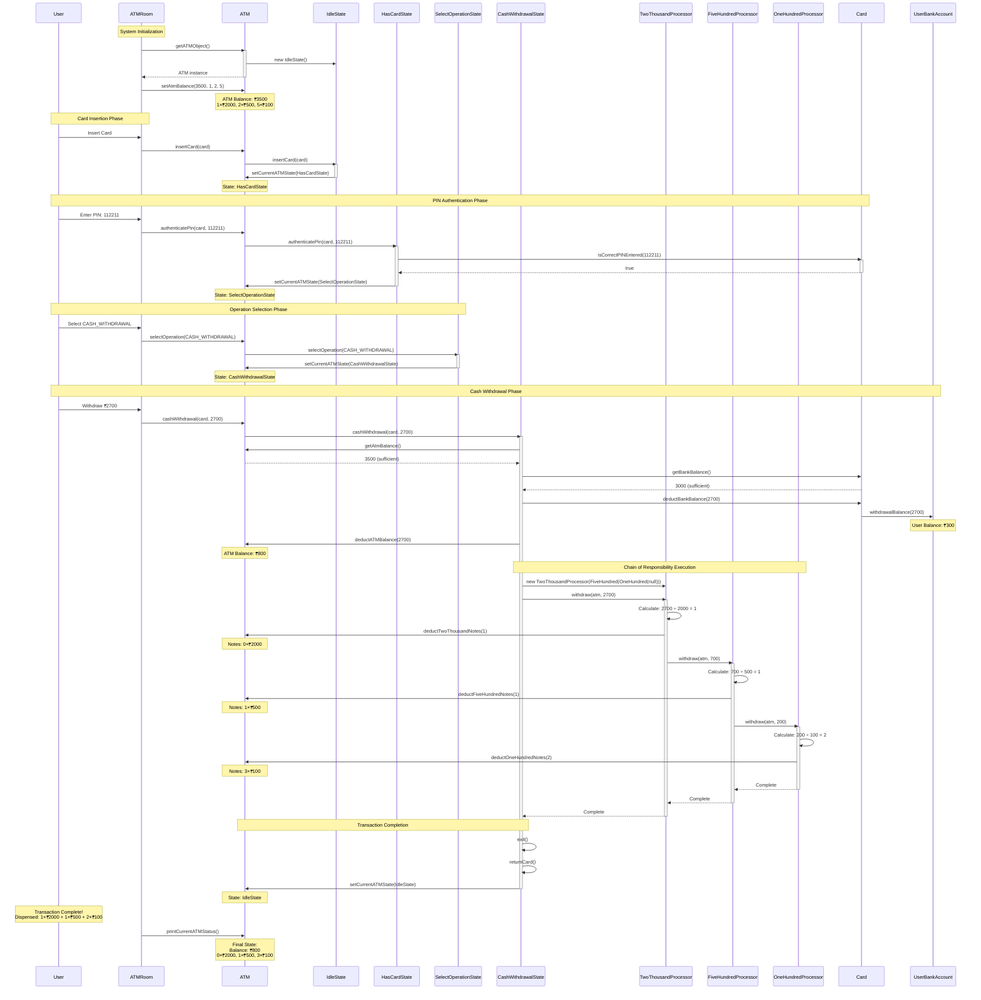

# ATM Machine System - Design Documentation

## Requirements

### Functional Requirements
1. **Card Authentication**: Insert card and validate PIN
2. **Transaction Selection**: Choose between cash withdrawal and balance check
3. **Cash Withdrawal**: Withdraw amount with optimal note distribution
4. **Balance Inquiry**: Check account balance
5. **ATM Balance Management**: Track ATM cash inventory (₹2000, ₹500, ₹100 notes)
6. **User Account Management**: Maintain user bank account balance
7. **State Transitions**: Machine transitions through appropriate states during transaction

### Non-Functional Requirements
1. **Security**: PIN validation before any transaction
2. **Reliability**: Handle insufficient funds (ATM and user account)
3. **Maintainability**: Easy to add new transaction types or note denominations
4. **Singleton Pattern**: Single ATM instance throughout application

## Objectives

### Primary Objectives
1. **Implement State Pattern**: Manage ATM behavior across different states
2. **Implement Chain of Responsibility**: Handle cash withdrawal with multiple note processors
3. **Separation of Concerns**: Isolate authentication, transaction, and cash dispensing logic
4. **Error Handling**: Gracefully handle insufficient funds and invalid operations

### Design Objectives
1. Create a flexible architecture supporting future enhancements
2. Minimize coupling between components
3. Follow SOLID principles
4. Use appropriate design patterns for each responsibility

## Design Patterns Used

### 1. State Pattern (Implemented)
**Purpose**: Manage ATM behavior that changes based on internal state

**Implementation**:
- **Context**: `ATM` class maintains current state
- **State Interface**: Abstract `ATMState` class defines all possible operations
- **Concrete States**: 
  - `IdleState`: Waiting for card insertion
  - `HasCardState`: Card inserted, waiting for PIN
  - `SelectOperationState`: PIN validated, selecting transaction type
  - `CashWithdrawalState`: Processing cash withdrawal
  - `CheckBalanceState`: Displaying balance

**Benefits**:
- Eliminates complex conditional logic
- Each state encapsulates its own behavior
- Easy to add new states (e.g., CardTransferState, DepositState)
- State transitions are explicit and controlled

**State Transitions**:
```
IdleState → HasCardState (insert card)
HasCardState → SelectOperationState (correct PIN)
HasCardState → IdleState (wrong PIN)
SelectOperationState → CashWithdrawalState (withdraw)
SelectOperationState → CheckBalanceState (check balance)
CashWithdrawalState → IdleState (transaction complete)
CheckBalanceState → IdleState (transaction complete)
```

### 2. Chain of Responsibility Pattern (Implemented)
**Purpose**: Handle cash withdrawal by processing note denominations in sequence

**Implementation**:
- **Handler**: Abstract `CashWithdrawProcessor` class
- **Concrete Handlers**: 
  - `TwoThousandWithdrawProcessor`: Processes ₹2000 notes first
  - `FiveHundredWithdrawProcessor`: Processes ₹500 notes second
  - `OneHundredWithdrawProcessor`: Processes ₹100 notes last

**How it works**:
```java
CashWithdrawProcessor withdrawProcessor = 
    new TwoThousandWithdrawProcessor(
        new FiveHundredWithdrawProcessor(
            new OneHundredWithdrawProcessor(null)
        )
    );

withdrawProcessor.withdraw(atmObject, 2700);
// Chain processes: 2000 → 500 → 100
// Result: 1x₹2000 + 1x₹500 + 2x₹100
```

**Benefits**:
- Decouples sender from receiver
- Easy to add new note denominations (e.g., ₹200, ₹50)
- Each processor has single responsibility
- Flexible chain composition

### 3. Singleton Pattern (Implemented)
**Purpose**: Ensure single ATM instance

**Implementation**:
```java
public class ATM {
    private static ATM atmObject = new ATM(); // Eager initialization
    
    private ATM() {}
    
    public static ATM getATMObject() {
        atmObject.setCurrentATMState(new IdleState());
        return atmObject;
    }
}
```

**Benefits**:
- Single point of control for ATM resources
- Consistent state across application
- Thread-safe with eager initialization

## UML Class Diagram



## State Transition Diagram



## Chain of Responsibility Flow Diagram



## Sequence Diagram - Complete Transaction Flow



## Class Responsibilities

### Core ATM Components

#### ATM (Singleton Context)
- **Purpose**: Central coordinator for ATM operations
- **Responsibilities**:
  - Maintain current state
  - Manage cash inventory (₹2000, ₹500, ₹100 notes)
  - Track total ATM balance
  - Provide single instance access
  - Deduct notes and balance on withdrawal
- **Design Pattern**: Singleton (eager initialization)
- **Key Methods**: 
  - `getATMObject()`: Returns singleton instance
  - `setCurrentATMState()`: Changes state
  - `deductTwoThousandNotes()`, `deductFiveHundredNotes()`, `deductOneHundredNotes()`: Update inventory

### State Pattern Components

#### ATMState (Abstract)
- **Purpose**: Define interface for all ATM operations
- **Responsibilities**:
  - Declare all state-specific operations
  - Provide default error implementations
  - Allow subclasses to override relevant methods
- **Pattern Role**: State interface in State Pattern
- **Default Behavior**: Print "OOPS!! Something went wrong" for invalid operations

#### IdleState
- **Purpose**: Initial waiting state
- **Responsibilities**:
  - Accept card insertion
  - Transition to HasCardState
- **Valid Operations**: `insertCard()`
- **Entry Message**: None (silent state)

#### HasCardState
- **Purpose**: Card inserted, awaiting authentication
- **Responsibilities**:
  - Display "enter your card pin number"
  - Validate PIN against Card
  - Transition to SelectOperationState (success)
  - Return to IdleState (failure)
  - Return card on exit
- **Valid Operations**: `authenticatePin()`, `exit()`, `returnCard()`
- **Entry Message**: "enter your card pin number"

#### SelectOperationState
- **Purpose**: Display and select transaction type
- **Responsibilities**:
  - Show available operations (CASH_WITHDRAWAL, BALANCE_CHECK)
  - Route to CashWithdrawalState or CheckBalanceState
  - Handle invalid selections
  - Return card on exit
- **Valid Operations**: `selectOperation()`, `exit()`, `returnCard()`
- **Entry Message**: "Please select the Operation"

#### CashWithdrawalState
- **Purpose**: Process cash withdrawal transaction
- **Responsibilities**:
  - Validate ATM balance (sufficient funds check)
  - Validate user balance (sufficient funds check)
  - Deduct amount from user's bank account
  - Deduct amount from ATM balance
  - Create and execute Chain of Responsibility for note distribution
  - Return card and transition to IdleState
- **Valid Operations**: `cashWithdrawal()`, `exit()`, `returnCard()`
- **Entry Message**: "Please enter the Withdrawal Amount"

#### CheckBalanceState
- **Purpose**: Display account balance
- **Responsibilities**:
  - Retrieve and display balance from card
  - Return card and transition to IdleState
- **Valid Operations**: `displayBalance()`, `exit()`, `returnCard()`
- **Entry Message**: None (constructor has no message)

### Chain of Responsibility Components

#### CashWithdrawProcessor (Abstract Handler)
- **Purpose**: Define interface for cash withdrawal chain
- **Responsibilities**:
  - Hold reference to next processor in chain
  - Define withdraw operation
  - Pass remaining amount to next processor if balance > 0
- **Pattern Role**: Handler in Chain of Responsibility
- **Key Field**: `nextCashWithdrawalProcessor`

#### TwoThousandWithdrawProcessor
- **Purpose**: Process ₹2000 notes (first in chain)
- **Responsibilities**:
  - Calculate required ₹2000 notes: `required = amount / 2000`
  - Calculate remaining balance: `balance = amount % 2000`
  - Deduct notes from ATM (up to available count)
  - If ATM has insufficient ₹2000 notes, adjust balance
  - Pass remaining balance to next processor (FiveHundredWithdrawProcessor)
- **Algorithm**: Greedy approach (use maximum denomination first)
- **Next Handler**: FiveHundredWithdrawProcessor

#### FiveHundredWithdrawProcessor
- **Purpose**: Process ₹500 notes (second in chain)
- **Responsibilities**:
  - Calculate required ₹500 notes: `required = amount / 500`
  - Calculate remaining balance: `balance = amount % 500`
  - Deduct notes from ATM (up to available count)
  - If ATM has insufficient ₹500 notes, adjust balance
  - Pass remaining balance to next processor (OneHundredWithdrawProcessor)
- **Algorithm**: Greedy approach
- **Next Handler**: OneHundredWithdrawProcessor

#### OneHundredWithdrawProcessor
- **Purpose**: Process ₹100 notes (last in chain)
- **Responsibilities**:
  - Calculate required ₹100 notes: `required = amount / 100`
  - Calculate remaining balance: `balance = amount % 100`
  - Deduct notes from ATM (up to available count)
  - If balance remains after processing, print error message
  - No next processor (end of chain)
- **Algorithm**: Greedy approach
- **Next Handler**: null (terminator)
- **Error Handling**: Prints "Something went wrong" if balance cannot be fulfilled

### User & Account Components

#### User
- **Purpose**: Represent ATM user
- **Responsibilities**:
  - Hold card reference
  - Hold bank account reference
- **Data Structure**: Simple container class

#### Card
- **Purpose**: Represent user's ATM card
- **Responsibilities**:
  - Store PIN number (static: 112211)
  - Validate entered PIN
  - Link to user's bank account
  - Provide balance information via bank account
  - Deduct balance from bank account
- **Key Methods**:
  - `isCorrectPINEntered(int pin)`: Validates PIN
  - `getBankBalance()`: Returns account balance
  - `deductBankBalance(int amount)`: Withdraws from account

#### UserBankAccount
- **Purpose**: Represent user's bank account
- **Responsibilities**:
  - Maintain account balance
  - Process withdrawal (deduct balance)
  - Provide balance information
- **Key Methods**:
  - `withdrawalBalance(int amount)`: Deducts amount
  - `getBalance()`: Returns current balance
  - `setBalance(int balance)`: Initializes balance

### Supporting Components

#### TransactionType (Enum)
- **Purpose**: Define available transaction types
- **Values**: 
  - `CASH_WITHDRAWAL`: Withdraw cash
  - `BALANCE_CHECK`: Check account balance
- **Method**: `showAllTransactionTypes()`: Displays all types

#### ATMRoom (Main Application)
- **Purpose**: Bootstrap and demonstrate ATM system
- **Responsibilities**:
  - Initialize ATM with balance and notes
  - Create user with card and bank account
  - Simulate transaction flow
  - Display ATM status
- **Methods**:
  - `initialize()`: Sets up ATM and user
  - `createUser()`: Factory method for user
  - `createCard()`: Factory method for card
  - `createBankAccount()`: Factory method for account

## Relationship Types

| From | To | Relationship | Type | Description |
|------|-----|--------------|------|-------------|
| ATMState | IdleState, HasCardState, SelectOperationState, CashWithdrawalState, CheckBalanceState | Inheritance | extends | State pattern hierarchy |
| CashWithdrawProcessor | TwoThousandWithdrawProcessor, FiveHundredWithdrawProcessor, OneHundredWithdrawProcessor | Inheritance | extends | Chain of Responsibility hierarchy |
| ATM | ATMState | Composition | contains | ATM owns its state |
| CashWithdrawProcessor | CashWithdrawProcessor | Aggregation | next | Chain linking |
| CashWithdrawalState | CashWithdrawProcessor | Dependency | uses | Creates and uses chain |
| User | Card | Composition | has | User owns card |
| User | UserBankAccount | Composition | has | User owns account |
| Card | UserBankAccount | Association | references | Card links to account |
| IdleState | HasCardState | Dependency | creates | State transition |
| HasCardState | SelectOperationState | Dependency | creates | State transition |
| SelectOperationState | CashWithdrawalState | Dependency | creates | State transition |
| SelectOperationState | CheckBalanceState | Dependency | creates | State transition |
| ATMRoom | ATM | Association | uses | Main uses ATM |
| ATMRoom | User | Association | uses | Main uses User |

## Key Design Insights

### Strengths
1. **Dual Pattern Implementation**: Effectively combines State and Chain of Responsibility patterns
2. **Clear Separation**: State management and cash distribution are independent concerns
3. **Extensibility**: Easy to add new states (e.g., DepositState, TransferState) or note denominations
4. **Security**: PIN validation before any transaction
5. **Singleton ATM**: Single point of control for all operations
6. **Greedy Algorithm**: Efficient note distribution (largest denominations first)
7. **Error Handling**: Validates both ATM and user balances before withdrawal

### Current Limitations
1. **Static PIN**: PIN hardcoded in Card class (112211)
2. **No transaction history**: No logging or audit trail
3. **No receipt generation**: Missing receipt functionality
4. **Limited error messages**: Generic "Something went wrong" messages
5. **No retry mechanism**: Invalid PIN leads to immediate exit (no 3-attempt rule)
6. **No optimal change algorithm**: Uses greedy approach (may fail in edge cases)
7. **Single card**: System designed for one card/user at a time
8. **No card blocking**: No mechanism to block card after multiple failed attempts

### Potential Enhancements

#### 1. Strategy Pattern for Change Algorithm
```java
interface WithdrawalStrategy {
    Map<Integer, Integer> calculateNotes(int amount, ATM atm);
}

class GreedyWithdrawalStrategy implements WithdrawalStrategy { }
class OptimalWithdrawalStrategy implements WithdrawalStrategy { }
```

#### 2. Observer Pattern for Notifications
```java
interface TransactionObserver {
    void onTransactionComplete(Transaction txn);
}

class SMSNotifier implements TransactionObserver { }
class EmailNotifier implements TransactionObserver { }
class AuditLogger implements TransactionObserver { }
```

#### 3. Factory Pattern for Card Types
```java
interface CardFactory {
    Card createCard();
}

class DebitCardFactory implements CardFactory { }
class CreditCardFactory implements CardFactory { }
class PrepaidCardFactory implements CardFactory { }
```

#### 4. Decorator Pattern for Transaction Fees
```java
abstract class TransactionDecorator {
    protected Transaction transaction;
    abstract int calculateFee();
}

class ServiceChargeDecorator extends TransactionDecorator { }
class TaxDecorator extends TransactionDecorator { }
```

#### 5. Command Pattern for Transaction History
```java
interface Command {
    void execute();
    void undo();
}

class WithdrawCommand implements Command { }
class DepositCommand implements Command { }
```

